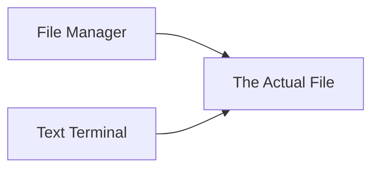

[[Reading file the hard way]]

File don't actually live in GUI ( obviously ).

Both of the terminal text and file manager see the file at the same place

### Reading file with Rust

```rust
use std::{
	fs::File,
	io::{Error, Read},
}

fn main() -> Result<(), Error> {
	let mut file = File::open("/etc/hosts")?;
	let mut text = String::new();
	file.read_to_string(&mut text)?;
	println!("{}", text);
	
	Ok(())
}
```

The cargo run is going to print the contents of /etc/hosts.
This program obviously open the file but don't do nothing out of it.

>[! Notes]
> In rust we must create a file to contains our buffer ( file )
> Reading and writing to a file are both able to fail 

### Reading file with C

```C
#include <stdio.h>
#include <stdlib.h>
#include <stdbool.h>

int main(int argc, char **argv) {
	FILE *file = fopen("/etc/hosts", "r");
	if (!file) {
		fprintf(stderr, "couldn't open the file\n");
		return 1;
	}
	
	const size_t buffer_size = 16;
	char *buffer = malloc(buffer_size);
	
	while (true) {
		size_t size = fread(buffer, 1, buffer_size - 1, file);
		if (size == 0) {
			break;
		}
		
		buffer[size] = "\0";
		printf("%s", buffer);
	}
	printf("\n");
	return 0;
}
```

### Reading file in C, without stdio

```
#include <stdio.h>

int main(int argc, char **argv) {
	for (int i = 0; i < 20; i++) {
		fprintf(stdout, ".");
	}
	
	*((char *) 0xBADBADBAD) = 43;
}
```

obviously this code gonna crash and show me: 

```
$ gcc -O3 --std=c99 -Wall -Wpedantic woops.c -o woops 
$ ./woops
[1] 22082 segmentation fault (core dumped) ./woops
```

The dot didn't get written out until the newline is printed.

>[! Fun Fact]
>
>This line:
>
 `*((char*) 0xBADBADBAD) = 43;`
>
>…causes a _segmentation fault_ because we’re writing to memory that is almost definitely not valid in our process’s address space.
>
>However, we can’t rely on this always happening. On some [embedded systems](https://en.wikipedia.org/wiki/Embedded_system), this would either silently corrupt data or do nothing.

### A bit of introspection

Strace command allow us to see what is used under the hood of function and programs we use.
Example with cat:

```bash
$ strace cat /etc/hosts
execve("/usr/bin/cat", ["cat", "/etc/hosts"], 0x7ffee7075518 /* 60 vars */) = 0 brk(NULL) = 0x560f3346c000
arch_prctl(0x3001 /* ARCH_??? */, 0x7fff4452be80) = -1 EINVAL (Invalid argument) mmap(NULL, 8192, PROT_READ|PROT_WRITE, MAP_PRIVATE|MAP_ANONYMOUS, -1, 0) = 0x7fe562a81000 
access("/etc/ld.so.preload", R_OK) = -1 ENOENT (No such file or directory) openat(AT_FDCWD, "/etc/ld.so.cache", O_RDONLY|O_CLOEXEC) = 3 
newfstatat(3, "", {st_mode=S_IFREG|0644, st_size=88313, ...}, AT_EMPTY_PATH) = 0 mmap(NULL, 88313, PROT_READ, MAP_PRIVATE, 3, 0) = 0x7fe562a6b000 
close(3) = 0 
openat(AT_FDCWD, "/lib/x86_64-linux-gnu/libc.so.6", O_RDONLY|O_CLOEXEC) = 3 read(3, "\177ELF\2\1\1\3\0\0\0\0\0\0\0\0\3\0>\0\1\0\0\0\3206\2\0\0\0\0\0"..., 832) = 832 
(cut)
```

Strace stand for "system trace".

We can also use strace on the binary C file.

```
$ strace ./readfile 
(cut) 
openat(AT_FDCWD, "/etc/hosts", O_RDONLY) = 3 getrandom("\x99\x17\x0c\x29\x8c\xf3\x28\x2e", 8, GRND_NONBLOCK) = 8 
brk(NULL) = 0x55cabb575000 
brk(0x55cabb596000) = 0x55cabb596000 
read(3, "127.0.0.1\tlocalh", 16) = 16 
write(1, "127.0.0.1\tlocalh", 16127.0.0.1 localh) = 16
```

And see that between those 2 things there is similarity ( cat and ./readfile )

![[Pasted image 20260917225955.png]]

