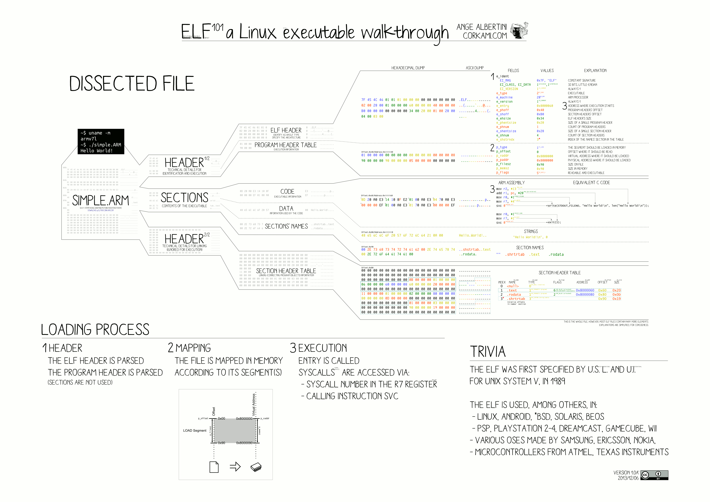

# Woody Woodpacker — Work Breakdown



---

## Legend

- **ID** — a stable handle (`T4.2`) for reference in commits and notes.
- **Touches** — the file or module the task modifies.
- **Depends on** — what must be closed first.
- **Done when** — the checkpoint that closes the task.
- Status: `[x]` done · `[~]` in progress · `[ ]` not started.

## Current standing

- `[x]` **M0–M1** Subject and ELF knowledge — acquired.
- `[~]` **M2** ELF parser — header read and borrowed; validation and
  segment location still open.
- `[~]` **M3** I/O — reading done; writing not yet begun.
- `[ ]` **M4 onward** — untouched.

---

## M1 — ELF knowledge (self-verification)

> **Research notes:** [M1 — ELF knowledge](research/M1.md)

Knowledge, not code. Close each by explaining it aloud, without notes.

- `[ x ]` **K1.1** Explain the role of `Elf64_Ehdr`.
- `[ ]` **K1.2** Explain the role of `Elf64_Phdr`.
- `[ ]` **K1.3** Explain how a `PT_LOAD` segment maps file bytes to memory.
- `[ ]` **K1.4** Explain the tie between file offset and virtual address.
- `[ ]` **K1.5** Explain how execution reaches `e_entry`.

**Milestone done when** all five can be stated plainly.

### References

- ELF header & program headers — `elf(5)`: https://man7.org/linux/man-pages/man5/elf.5.html
- How the kernel runs an ELF — LWN: https://lwn.net/Articles/631631/
- Header to entry point, walked through — Bendersky: https://eli.thegreenplace.net/2012/08/13/how-statically-linked-programs-run-on-linux
- `PT_LOAD` file-to-memory mapping — Urdhr: https://www.gabriel.urdhr.fr/2015/01/22/elf-linking/

---

## M2 — ELF parser  `[~]`

> **Research notes:** [M2 — ELF parser](research/M2.md)

The reading half. It interprets borrowed bytes and yields a *view*; it
alters nothing.

- `[ ]` **T2.1 — Define the view.**
  A struct gathering the borrowed `Ehdr`, the Phdr table (offset + count),
  the target `PT_LOAD`, and the entry point's file offset.
  - Touches: `includes/elf/parser_elf.h`
  - Depends on: —
  - Done when: the struct compiles and `data_t` can hold it.

- `[ ]` **T2.2 — Validate the header.**
  Magic `ELFMAG`, class `ELFCLASS64`, machine `EM_X86_64`, type `ET_EXEC`
  or `ET_DYN`. Reject cleanly on any failure.
  - Touches: `srcs/elf/validate.c`
  - Depends on: T2.1
  - Done when: a forged/truncated file is refused with a clear error.

- `[ ]` **T2.3 — Walk the program headers.**
  Iterate `e_phnum` entries from `e_phoff`, bounds-checked against the map.
  - Touches: `srcs/elf/parser.c`
  - Depends on: T2.2
  - Done when: every Phdr is visited without reading past the mapping.

- `[ ]` **T2.4 — Locate the target segment.**
  Find the executable `PT_LOAD` whose address range contains `e_entry`;
  record its file offset and size.
  - Touches: `srcs/elf/segment.c`
  - Depends on: T2.3
  - Done when: the chosen segment matches what `readelf -l` shows.

- `[ ]` **T2.5 — Assemble and return the view.**
  `parse_elf` orchestrates T2.2–T2.4 and fills the view; it delegates, it
  does not inline their logic.
  - Touches: `srcs/elf/parser.c`
  - Depends on: T2.4
  - Done when: the view is complete for every valid test binary.

**Milestone done when** valid ELF64 is parsed into a complete view, invalid
input is rejected cleanly, and all ELF logic lives in the `elf` module.

### References

- `Ehdr`/`Phdr` fields — `elf(5)`: https://man7.org/linux/man-pages/man5/elf.5.html
- A parser walked step by step — Krinkin: https://krinkinmu.github.io/2020/11/15/loading-elf-image.html
- Program headers explained — k3170makan (part II): http://blog.k3170makan.com/2018/09/introduction-to-elf-format-part-ii.html
- Cross-check tool — `readelf(1)`: https://man7.org/linux/man-pages/man1/readelf.1.html
- The authoritative layout — x86-64 psABI: https://gitlab.com/x86-psABIs/x86-64-ABI

---

## M3 — I/O  `[~]`

> **Research notes:** [M3 — I/O](research/M3.md)

The only quarter that touches descriptors and mappings.

- `[x]` **T3.1 — Read into memory.** `load_bin` maps the file.
  - Touches: `srcs/io/bin_io.c`

- `[ ]` **T3.2 — Write the output.**
  `write_woody` emits a new file from a buffer/view.
  - Touches: `srcs/io/bin_io.c`
  - Depends on: T2.1
  - Done when: an unmodified copy is byte-identical to the source.

- `[ ]` **T3.3 — Preserve permissions.**
  The output carries the executable bit.
  - Touches: `srcs/io/bin_io.c`
  - Depends on: T3.2
  - Done when: `woody` runs without a manual `chmod`.

- `[x]` **T3.4 — Errors and cleanup.** Handled by `error.c` / `cleaning.c`.
  - Touches: `srcs/utils/error.c`, `srcs/utils/cleaning.c`

**Milestone done when** an ELF can be loaded whole and written back intact,
errors are handled, and nothing leaks.

### References

- Map the file — `mmap(2)`: https://man7.org/linux/man-pages/man2/mmap.2.html
- Open it — `open(2)`: https://man7.org/linux/man-pages/man2/open.2.html
- Size it — `lseek(2)`: https://man7.org/linux/man-pages/man2/lseek.2.html
- Write it — `write(2)`: https://man7.org/linux/man-pages/man2/write.2.html
- Keep the executable bit — `fchmod(2)`: https://man7.org/linux/man-pages/man2/fchmod.2.html

---

## M4 — Packer design (on paper)

> **Research notes:** [M4 — Packer design](research/M4.md)

A decision milestone. Produce a diagram, not code.

- `[ ]` **T4.1** Decide which region is enciphered (the target `PT_LOAD`).
- `[ ]` **T4.2** Decide where the ciphertext lives (in place).
- `[ ]` **T4.3** Decide where the stub lives (extend last `PT_LOAD`, or
  convert `PT_NOTE` to `PT_LOAD`).
- `[ ]` **T4.4** Decide how the original `e_entry` is preserved and reached.
- `[ ]` **T4.5** Draw the runtime flow: entry → stub → decrypt → original.

**Milestone done when** a before/after ELF layout can be drawn from memory.

### References

- `PT_NOTE` to `PT_LOAD`, step by step — SymbolCrash: https://www.symbolcrash.com/2019/03/27/pt_note-to-pt_load-injection-in-elf/
- Full infection walkthrough — hexagram.dev: https://hexagram.dev/posts/infecting-linux-elf-files/
- Reference implementation (subject's author) — note_infector: https://github.com/alagroy-42/note_infector
- The technique in a book chapter — Learning Linux Binary Analysis, ch. 4: https://subscription.packtpub.com/book/networking-and-servers/9781782167105/4/ch04lvl1sec36/the-pt-note-to-pt-load-conversion-infection-method

---

## M5 — Encryption

> **Research notes:** [M5 — Encryption](research/M5.md)

- `[ ]` **T5.1 — Generate a random key.**
  - Touches: `srcs/crypto/keygen.c`
  - Depends on: —
  - Done when: the key is drawn from a strong source and printed on stdout.

- `[ ]` **T5.2 — Encipher the region.**
  - Touches: `srcs/crypto/cipher.c`
  - Depends on: T2.4, T5.1
  - Done when: the target segment is transformed in place.

- `[ ]` **T5.3 — Define the stub's datum.**
  Key, offset, and length the stub will need.
  - Touches: `includes/crypto/cipher.h`
  - Depends on: T5.2
  - Done when: the datum is fixed and reachable by the stub.

- `[ ]` **T5.4 — Test cipher/decipher in isolation.**
  - Touches: `tests/`
  - Depends on: T5.2
  - Done when: decryption restores the plaintext exactly.

**Milestone done when** decryption restores the plaintext exactly and the
stub's required data is fixed. (A plain ROT/XOR is *not* deemed advanced.)

### References

- Random key from the kernel — `getrandom(2)`: https://man7.org/linux/man-pages/man2/getrandom.2.html
- `/dev/urandom` — `random(4)`: https://man7.org/linux/man-pages/man4/random.4.html
- A simple, defensible block cipher — XTEA: https://en.wikipedia.org/wiki/XTEA
- A simple stream cipher — RC4: https://en.wikipedia.org/wiki/RC4

---

## M6 — Stub (assembly)

> **Research notes:** [M6 — Stub](research/M6.md)

- `[ ]` **T6.1 — Position-independent addressing** of its own data.
  - Touches: `asm/stub.s`
  - Depends on: M5
  - Done when: the stub finds its data with no absolute address.

- `[ ]` **T6.2 — Decryption loop.**
  - Touches: `asm/stub.s`
  - Depends on: T6.1
  - Done when: the loop reproduces the C decryption exactly.

- `[ ]` **T6.3 — Print `....WOODY....\n`.**
  - Touches: `asm/stub.s`
  - Depends on: T6.1
  - Done when: the string appears once, before the program runs.

- `[ ]` **T6.4 — Restore state and jump** to the original entry.
  - Touches: `asm/stub.s`
  - Depends on: T6.2
  - Done when: registers/stack are restored and control returns cleanly.

**Milestone done when** the stub runs standalone, decrypts, and hands
control back cleanly.

### References

- Calling convention & registers — x86-64 psABI: https://gitlab.com/x86-psABIs/x86-64-ABI
- Every instruction, searchable — felixcloutier: https://www.felixcloutier.com/x86/
- Assembler manual — NASM: https://www.nasm.us/doc/
- A gentle NASM start — LMU tutorial: https://cs.lmu.edu/~ray/notes/nasmtutorial/
- Syscall numbers (x86-64) — table: https://x64.syscall.sh/

---

## M7 — Injection and ELF modification

> **Research notes:** [M7 — Injection](research/M7.md)

- `[ ]` **T7.1 — Place the stub** in the chosen location.
  - Touches: `srcs/packer/stub.c`
  - Depends on: M4, M6
  - Done when: the stub bytes sit where the design intends.

- `[ ]` **T7.2 — Adjust the segment**: `p_filesz`, `p_memsz`, `p_flags`.
  - Touches: `srcs/packer/packer.c`
  - Depends on: T7.1
  - Done when: the segment covers the stub and is executable.

- `[ ]` **T7.3 — Fix offsets and alignment** (`p_align`).
  - Touches: `srcs/packer/packer.c`
  - Depends on: T7.2
  - Done when: every offset stays coherent under the map.

- `[ ]` **T7.4 — Redirect `e_entry`** to the stub.
  - Touches: `srcs/packer/packer.c`
  - Depends on: T7.3
  - Done when: execution reaches the stub first.

**Milestone done when** `readelf` reports coherent headers and the stub
sits where intended.

### References

- Phdr fields to adjust — `elf(5)`: https://man7.org/linux/man-pages/man5/elf.5.html
- The modification algorithm — SymbolCrash: https://www.symbolcrash.com/2019/03/27/pt_note-to-pt_load-injection-in-elf/
- Verify the result — `readelf(1)`: https://man7.org/linux/man-pages/man1/readelf.1.html
- Extract the stub bytes — `objcopy(1)`: https://man7.org/linux/man-pages/man1/objcopy.1.html

---

## M8 — Integration

> **Research notes:** [M8 — Integration](research/M8.md)

- `[ ]` **T8.1 — Write `pack`** to chain parse → encrypt → inject → write.
  - Touches: `srcs/packer/packer.c`
  - Depends on: M2, M3, M5, M7
  - Done when: the four steps run in sequence from one call.

- `[ ]` **T8.2 — Wire `main`** to call `pack`.
  - Touches: `srcs/main.c`
  - Depends on: T8.1
  - Done when: `main` drives the pipeline and cleans up.

- `[ ]` **T8.3 — Produce and run** the packed binary end to end.
  - Touches: —
  - Depends on: T8.2
  - Done when: `woody` decrypts and runs identically to the original.

**Milestone done when** `./woody_woodpacker <bin>` yields a working `woody`.

### References

- Disassemble & compare — `objdump(1)`: https://man7.org/linux/man-pages/man1/objdump.1.html
- Inspect headers/segments — `readelf(1)`: https://man7.org/linux/man-pages/man1/readelf.1.html

---

## M9 — Testing

> **Research notes:** [M9 — Testing](research/M9.md)

- `[ ]` **T9.1** Minimal ELF · **T9.2** dynamically linked · **T9.3** PIE.
- `[ ]` **T9.4** Varied segment layouts · **T9.5** varied sizes.
- `[ ]` **T9.6** Programs with arguments · **T9.7** using stdin/stdout.
- `[ ]` **T9.8** Invalid ELF · **T9.9** error cases.

**Milestone done when** every case passes and packed output matches the
original where required.

### References

- Building PIE / no-pie / static — GCC link options: https://gcc.gnu.org/onlinedocs/gcc/Link-Options.html
- Verify segments per test — `readelf(1)`: https://man7.org/linux/man-pages/man1/readelf.1.html
- Compare disassembly — `objdump(1)`: https://man7.org/linux/man-pages/man1/objdump.1.html

---

## M10 — Hardening and cleanup

> **Research notes:** [M10 — Cleanup](research/M10.md)

- `[ ]` **T10.1** Review memory and descriptor handling.
- `[ ]` **T10.2** Review error handling; verify permissions.
- `[ ]` **T10.3** Verify offsets and alignment.
- `[ ]` **T10.4** Run `valgrind` clean.
- `[ ]` **T10.5** Run regression tests; tidy the Makefile.
- `[ ]` **T10.6** Remove debug code; read the project against the subject.

**Final gate:** builds from a clean checkout, all tests pass, no leaks, and
every important part can be explained aloud.

### References

- Leak audit, quick start — Valgrind: https://valgrind.org/docs/manual/quick-start.html
- Memcheck in detail — Valgrind: https://valgrind.org/docs/manual/mc-manual.html
- AddressSanitizer — Clang: https://clang.llvm.org/docs/AddressSanitizer.html
- UndefinedBehaviorSanitizer — Clang: https://clang.llvm.org/docs/UndefinedBehaviorSanitizer.html

---

## Priority (dependency chain)

```text
  M1 ELF64
    ↓
  Program Headers / PT_LOAD
    ↓
  Binary analysis (readelf cross-check)
    ↓
  M2 ELF parser ── M3 I/O
    ↓
  M4 Packer design
    ↓
  M5 Encryption
    ↓
  M6 ASM stub
    ↓
  M7 ELF modification
    ↓
  M8 Integration
    ↓
  M9 Testing
    ↓
  M10 Cleanup
```
